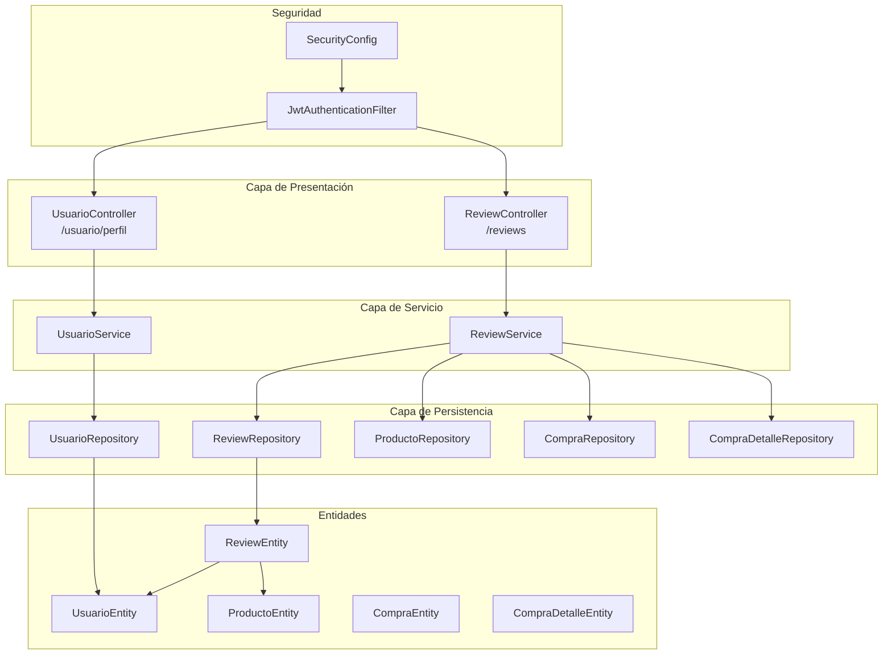
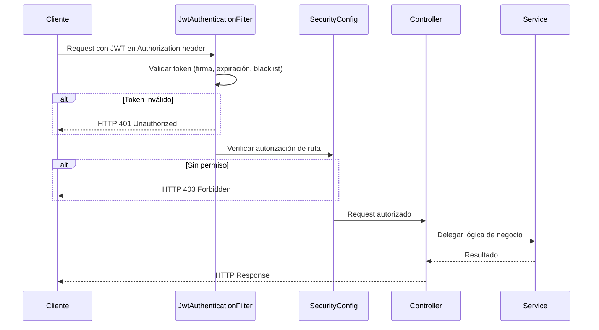
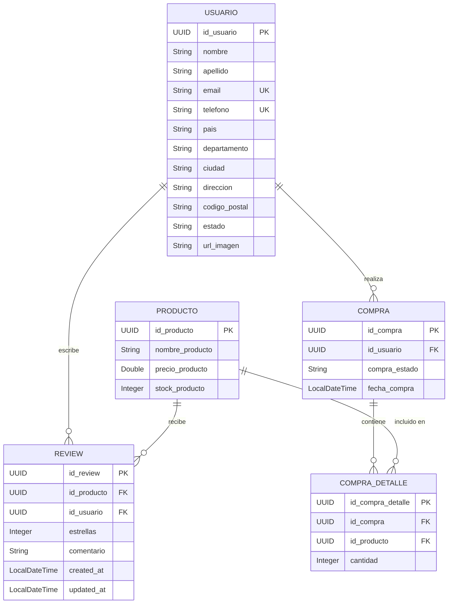
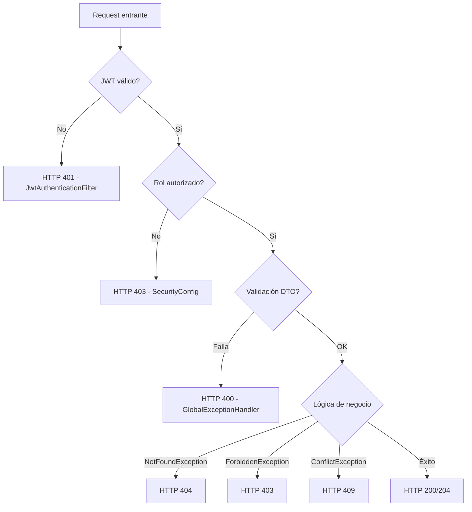

# Design Document: Profile Update and Reviews

## Overview

Este diseño cubre dos módulos del backend e-commerce Spring Boot:

1. **Perfil de usuario**: Endpoints GET/PUT para que un cliente autenticado consulte y actualice su información personal, incluyendo el nuevo campo `apellido` en `UsuarioEntity`.
2. **Reseñas de productos**: CRUD completo con una nueva entidad `ReviewEntity`, servicio dedicado `ReviewService`, controlador `ReviewController` y repositorio `ReviewRepository`. Solo clientes con compras completadas (ACEPTADO/ENTREGADO) pueden crear reseñas, con restricción de una reseña por usuario por producto.

Ambos módulos se integran con la arquitectura existente: controladores REST → servicios → repositorios, DTOs con Bean Validation, excepciones centralizadas en `GlobalExceptionHandler`, autenticación JWT con `SecurityConfig`, y convenciones de Lombok + UUID generados con `@UuidGenerator(style = TIME)`.

---

## Architecture

### Diagrama de Componentes



### Flujo de Autenticación



### Decisiones Arquitectónicas

| Decisión | Justificación |
|----------|--------------|
| Perfil en `UsuarioController` existente | Mantiene cohesión: operaciones sobre el usuario en un solo controlador |
| `ReviewService` independiente | Separación de responsabilidades: la lógica de reseñas es un dominio distinto |
| Upsert (crear/actualizar) en un solo endpoint POST | Simplifica la API del cliente; la restricción de unicidad en BD garantiza integridad |
| Endpoint público para lectura de reseñas | Permite que visitantes no autenticados vean valoraciones de productos |
| `FetchType.LAZY` en relaciones de ReviewEntity | Evita N+1 queries; se usan proyecciones en las consultas |

---

## Components and Interfaces

### 1. UsuarioController (Extensión)

**Nuevos endpoints en `/usuario`:**

| Método | Ruta | Rol Requerido | Descripción |
|--------|------|---------------|-------------|
| GET | `/usuario/perfil` | Autenticado | Obtener perfil del usuario autenticado |
| PUT | `/usuario/perfil` | Autenticado | Actualizar perfil del usuario autenticado |

```java
@GetMapping("/perfil")
public ResponseEntity<UsuarioPerfilResponseDTO> obtenerPerfil();

@PutMapping("/perfil")
public ResponseEntity<UsuarioPerfilResponseDTO> actualizarPerfil(
    @Valid @RequestBody UsuarioUpdateDTO usuarioUpdateDTO);
```

### 2. ReviewController

**Nuevo controlador: `@RestController @RequestMapping("/reviews")`**

| Método | Ruta | Rol Requerido | Descripción |
|--------|------|---------------|-------------|
| POST | `/reviews` | CLIENTE | Crear o actualizar reseña |
| DELETE | `/reviews/{idReview}` | CLIENTE | Eliminar reseña propia |
| GET | `/reviews/producto/{idProducto}` | Público | Listar reseñas de un producto (paginado) |
| GET | `/reviews/producto/{idProducto}/estadisticas` | Público | Promedio y total de reseñas |
| GET | `/reviews/producto/{idProducto}/mi-review` | Autenticado | Obtener reseña propia para un producto |

```java
@PostMapping
public ResponseEntity<ReviewResponseDTO> crearOActualizarReview(
    @Valid @RequestBody ReviewCreateDTO reviewCreateDTO);

@DeleteMapping("/{idReview}")
public ResponseEntity<Void> eliminarReview(@PathVariable UUID idReview);

@GetMapping("/producto/{idProducto}")
public ResponseEntity<PaginacionResponseDTO<ReviewResponseDTO>> obtenerReviewsProducto(
    @PathVariable UUID idProducto,
    @RequestParam(defaultValue = "0") int pagina,
    @RequestParam(defaultValue = "10") int tamanio);

@GetMapping("/producto/{idProducto}/estadisticas")
public ResponseEntity<ReviewEstadisticasDTO> obtenerEstadisticas(
    @PathVariable UUID idProducto);

@GetMapping("/producto/{idProducto}/mi-review")
public ResponseEntity<ReviewResponseDTO> obtenerMiReview(
    @PathVariable UUID idProducto);
```

### 3. UsuarioService (Extensión)

**Nuevos métodos:**

```java
public UsuarioPerfilResponseDTO obtenerPerfil(UUID idUsuario);
public UsuarioPerfilResponseDTO actualizarPerfil(UUID idUsuario, UsuarioUpdateDTO dto);
```

### 4. ReviewService

**Nuevo servicio con inyección por constructor:**

```java
@Service
public class ReviewService {
    private final ReviewRepository reviewRepository;
    private final ProductoRepository productoRepository;
    private final CompraRepository compraRepository;
    private final CompraDetalleRepository compraDetalleRepository;

    public ReviewResponseDTO crearOActualizar(UUID idUsuario, ReviewCreateDTO dto);
    public void eliminar(UUID idReview, UUID idUsuario);
    public PaginacionResponseDTO<ReviewResponseDTO> obtenerPorProducto(UUID idProducto, int pagina, int tamanio);
    public ReviewEstadisticasDTO obtenerEstadisticas(UUID idProducto);
    public ReviewResponseDTO obtenerReviewUsuario(UUID idUsuario, UUID idProducto);
}
```

### 5. ReviewRepository

```java
public interface ReviewRepository extends JpaRepository<ReviewEntity, UUID> {
    Page<ReviewEntity> findByProductoIdProducto(UUID idProducto, Pageable pageable);
    Optional<ReviewEntity> findByUsuarioIdUsuarioAndProductoIdProducto(UUID idUsuario, UUID idProducto);

    @Query("SELECT AVG(r.estrellas) FROM ReviewEntity r WHERE r.producto.idProducto = :idProducto")
    Optional<Double> promedioEstrellasPorProducto(@Param("idProducto") UUID idProducto);

    @Query("SELECT COUNT(r) FROM ReviewEntity r WHERE r.producto.idProducto = :idProducto")
    Long contarPorProducto(@Param("idProducto") UUID idProducto);
}
```

### 6. SecurityConfig (Extensión)

Nuevas reglas en `authorizeHttpRequests`:

```java
// Reseñas: lectura pública
.requestMatchers(HttpMethod.GET, "/reviews/producto/**").permitAll()
// Reseñas: escritura solo CLIENTE
.requestMatchers(HttpMethod.POST, "/reviews").hasRole("CLIENTE")
.requestMatchers(HttpMethod.DELETE, "/reviews/**").hasRole("CLIENTE")
// Reseña propia: autenticado
.requestMatchers(HttpMethod.GET, "/reviews/producto/*/mi-review").authenticated()
// Perfil: autenticado
.requestMatchers(HttpMethod.GET, "/usuario/perfil").authenticated()
.requestMatchers(HttpMethod.PUT, "/usuario/perfil").authenticated()
```

---

## Data Models

### ReviewEntity (Nueva)

```java
@Getter
@Setter
@Entity
@Table(name = "review",
    uniqueConstraints = @UniqueConstraint(
        name = "uk_review_usuario_producto",
        columnNames = {"id_usuario", "id_producto"}
    ),
    indexes = {
        @Index(name = "idx_review_id_producto", columnList = "id_producto"),
        @Index(name = "idx_review_id_usuario", columnList = "id_usuario")
    }
)
public class ReviewEntity {

    @Id
    @UuidGenerator(style = UuidGenerator.Style.TIME)
    @Column(name = "id_review", columnDefinition = "UUID", updatable = false, nullable = false)
    private UUID idReview;

    @ManyToOne(fetch = FetchType.LAZY)
    @JoinColumn(name = "id_producto", referencedColumnName = "id_producto", nullable = false)
    private ProductoEntity producto;

    @ManyToOne(fetch = FetchType.LAZY)
    @JoinColumn(name = "id_usuario", referencedColumnName = "id_usuario", nullable = false)
    private UsuarioEntity usuario;

    @Column(name = "estrellas", nullable = false)
    private Integer estrellas;

    @Column(name = "comentario", length = 1000, nullable = false)
    private String comentario;

    @Column(name = "created_at", nullable = false, updatable = false)
    private LocalDateTime createdAt;

    @Column(name = "updated_at", nullable = false)
    private LocalDateTime updatedAt;
}
```

**Check constraint para estrellas (en DDL/migración):**
```sql
ALTER TABLE review ADD CONSTRAINT chk_review_estrellas CHECK (estrellas >= 1 AND estrellas <= 5);
```

### UsuarioEntity (Modificación)

Agregar campo `apellido`:

```java
@Column(name = "apellido", length = 100)
private String apellido;
```

### DTOs

#### UsuarioUpdateDTO

```java
@Data
public class UsuarioUpdateDTO {
    @NotBlank @Size(min = 3, max = 100)
    private String nombre;

    @NotBlank @Size(min = 3, max = 100)
    private String apellido;

    @NotBlank @Size(min = 10, max = 20)
    @Pattern(regexp = "^\\d+$", message = "El teléfono solo debe contener dígitos")
    private String telefono;

    @NotBlank @Size(min = 3, max = 30)
    private String pais;

    @NotBlank @Size(min = 3, max = 50)
    private String departamento;

    @NotBlank @Size(min = 3, max = 50)
    private String ciudad;

    @NotBlank @Size(min = 10, max = 100)
    private String direccion;

    @Size(max = 17)
    private String codigoPostal;
}
```

#### UsuarioPerfilResponseDTO

```java
@Data
public class UsuarioPerfilResponseDTO {
    private String nombre;
    private String apellido;
    private String email;
    private String telefono;
    private String pais;
    private String departamento;
    private String ciudad;
    private String direccion;
    private String codigoPostal;
}
```

#### ReviewCreateDTO

```java
@Data
public class ReviewCreateDTO {
    @NotNull
    private UUID idProducto;

    @NotNull @Min(1) @Max(5)
    private Integer estrellas;

    @NotBlank @Size(min = 1, max = 1000)
    private String comentario;
}
```

#### ReviewResponseDTO

```java
@Data
public class ReviewResponseDTO {
    private UUID idReview;
    private UUID idProducto;
    private UUID idUsuario;
    private String nombreUsuario;
    private Integer estrellas;
    private String comentario;
    private LocalDateTime createdAt;
    private LocalDateTime updatedAt;
}
```

#### ReviewEstadisticasDTO

```java
@Data
public class ReviewEstadisticasDTO {
    private Double promedioEstrellas;
    private Long totalResenas;
}
```

### Diagrama Entidad-Relación



---


## Correctness Properties

*A property is a characteristic or behavior that should hold true across all valid executions of a system—essentially, a formal statement about what the system should do. Properties serve as the bridge between human-readable specifications and machine-verifiable correctness guarantees.*

### Property 1: Profile mapping preserves all fields

*For any* valid UsuarioEntity with populated fields (nombre, apellido, email, telefono, pais, departamento, ciudad, direccion, codigoPostal), mapping it to UsuarioPerfilResponseDTO SHALL produce a DTO where each field equals the corresponding entity field.

**Validates: Requirements 1.1**

### Property 2: Profile update only modifies editable fields

*For any* valid UsuarioUpdateDTO and existing UsuarioEntity, applying the update SHALL change only the editable fields (nombre, apellido, telefono, pais, departamento, ciudad, direccion, codigoPostal) and SHALL leave protected fields (idUsuario, email, contrasenaEncp, estado, usuarioRol) unchanged.

**Validates: Requirements 2.1, 2.6**

### Property 3: UsuarioUpdateDTO validation rejects invalid inputs

*For any* string that violates the defined constraints (nombre/apellido shorter than 3 or longer than 100, telefono not matching `^\d+$` or outside 10-20 chars, pais shorter than 3 or longer than 30, departamento/ciudad shorter than 3 or longer than 50, direccion shorter than 10 or longer than 100, codigoPostal longer than 17), Bean Validation SHALL reject the DTO and produce at least one constraint violation for the invalid field.

**Validates: Requirements 2.3**

### Property 4: Review creation requires qualifying purchase

*For any* user-product combination, creating a review SHALL succeed only if there exists at least one CompraEntity with estado ACEPTADO or ENTREGADO whose CompraDetalleEntity references the specified product for the authenticated user. If no qualifying purchase exists, the operation SHALL be rejected.

**Validates: Requirements 3.1, 3.2**

### Property 5: Review upsert preserves createdAt on update

*For any* existing review (user-product pair), submitting a new ReviewCreateDTO for the same user-product SHALL update estrellas and comentario to the new values, preserve the original createdAt timestamp, and set updatedAt to the current time. The total number of reviews for that user-product pair SHALL remain exactly one.

**Validates: Requirements 3.3**

### Property 6: Review comment is stored trimmed

*For any* comentario string with leading or trailing whitespace, the system SHALL store it with whitespace trimmed (equivalent to `comentario.trim()`), and the ReviewResponseDTO SHALL reflect the trimmed value.

**Validates: Requirements 3.7**

### Property 7: ReviewCreateDTO validation rejects invalid inputs

*For any* ReviewCreateDTO where estrellas is null or outside the range [1, 5], or idProducto is null, or comentario is blank after trim or exceeds 1000 characters, Bean Validation SHALL reject the DTO and produce at least one constraint violation.

**Validates: Requirements 3.4, 8.5**

### Property 8: Review ownership enforcement on delete

*For any* review and authenticated user, deletion SHALL succeed only if the review's usuario.idUsuario equals the authenticated user's idUsuario. If they differ, the system SHALL reject the operation with ForbiddenException.

**Validates: Requirements 4.1, 4.2**

### Property 9: Reviews pagination is ordered by createdAt descending

*For any* product with multiple reviews, the paginated response SHALL return reviews ordered by createdAt descending (most recent first). For any two consecutive reviews in the response, the first review's createdAt SHALL be greater than or equal to the second's.

**Validates: Requirements 5.1**

### Property 10: Page size defaults to 10 for invalid values

*For any* tamanio parameter value that is not one of {10, 25, 50}, the system SHALL use page size 10 for the query. For valid values (10, 25, 50), the system SHALL use the provided value.

**Validates: Requirements 5.5**

### Property 11: Statistics average uses HALF_UP rounding to one decimal

*For any* product with one or more reviews, the promedioEstrellas SHALL equal the arithmetic mean of all estrellas values for that product, rounded to one decimal place using RoundingMode.HALF_UP. The totalResenas SHALL equal the count of reviews for that product.

**Validates: Requirements 7.1**

### Property 12: ReviewEntity to ReviewResponseDTO mapping completeness

*For any* valid ReviewEntity with associated UsuarioEntity and ProductoEntity, mapping to ReviewResponseDTO SHALL produce a DTO where idReview, idProducto, idUsuario, nombreUsuario (from usuario.nombre), estrellas, comentario, createdAt, and updatedAt all equal their corresponding entity values.

**Validates: Requirements 3.8, 5.7**

---

## Error Handling

### Estrategia de Excepciones

El sistema reutiliza las excepciones existentes del proyecto, manejadas por `GlobalExceptionHandler`:

| Excepción | HTTP Status | Uso en esta feature |
|-----------|-------------|---------------------|
| `NotFoundException` | 404 | Usuario no encontrado, producto no encontrado, reseña no encontrada |
| `ForbiddenException` | 403 | Cuenta inactiva/cancelada, no tiene compra del producto, no es dueño de la reseña, ADMIN intentando crear reseña |
| `ConflictException` | 409 | Teléfono ya registrado por otro usuario |
| `BusinessRuleException` | 400 | Reglas de negocio violadas |
| Bean Validation | 400 | Campos inválidos en DTOs (manejado automáticamente por Spring) |
| Spring Security | 401/403 | Token inválido, acceso denegado por rol |

### Flujo de Errores



### Mensajes de Error Específicos

| Contexto | Mensaje |
|----------|---------|
| Perfil: usuario no encontrado | "Usuario no encontrado" |
| Perfil: cuenta inactiva | "La cuenta no se encuentra activa" |
| Perfil: teléfono duplicado | "El teléfono ya está registrado por otro usuario" |
| Review: sin compra | "Solo puedes reseñar productos que hayas comprado" |
| Review: producto no existe | "Producto no encontrado" |
| Review: no es dueño | "No tienes permiso para eliminar esta reseña" |
| Review: no encontrada | "Reseña no encontrada" |
| Review propia: no existe | "No has dejado una reseña para este producto" |

---

## Testing Strategy

### Enfoque Dual: Unit Tests + Property-Based Tests

Esta feature es adecuada para property-based testing (PBT) porque contiene:
- Funciones puras de mapeo entity ↔ DTO
- Lógica de validación con amplio espacio de inputs
- Reglas de negocio universales (propiedad de reseñas, requisito de compra)
- Computaciones matemáticas (promedio con redondeo)

### Property-Based Testing (jqwik)

El proyecto ya incluye **jqwik 1.8.4** como dependencia de test. Se usará para implementar las 12 correctness properties definidas arriba.

**Configuración:**
- Mínimo 100 iteraciones por property test
- Cada test anotado con tag referenciando la propiedad del diseño
- Formato de tag: `Feature: profile-update-and-reviews, Property {N}: {título}`

**Generadores necesarios:**
- `Arbitrary<UsuarioEntity>`: usuarios con datos válidos aleatorios
- `Arbitrary<UsuarioUpdateDTO>`: DTOs válidos e inválidos
- `Arbitrary<ReviewCreateDTO>`: DTOs con estrellas 1-5, comentarios variados
- `Arbitrary<ReviewEntity>`: reseñas con fechas y datos aleatorios
- `Arbitrary<String>` con whitespace: para test de trim

### Unit Tests (JUnit 5)

Cubren escenarios específicos y edge cases:
- Usuario con estado INACTIVO/CANCELADO accediendo a perfil → 403
- Producto no existente al crear reseña → 404
- Reseña no encontrada al eliminar → 404
- UUID inválido en path → 400
- Página fuera de rango → contenido vacío
- Producto sin reseñas → estadísticas 0.0/0
- Eliminación exitosa → 204 sin body

### Integration Tests (Spring Boot Test)

Cubren la capa de seguridad y la interacción completa:
- Endpoints públicos accesibles sin token
- Endpoints protegidos rechazan solicitudes sin token (401)
- ADMIN rechazado en endpoints de escritura de reseñas (403)
- CLIENTE puede crear/eliminar reseñas (200/204)
- Bean Validation retorna errores estructurados (400)
- Flujo completo: registrar → comprar → reseñar → consultar estadísticas

### Cobertura por Requirement

| Requirement | Property Tests | Unit Tests | Integration Tests |
|-------------|---------------|------------|-------------------|
| 1 (Get Perfil) | P1 | Estado inactivo, usuario no encontrado | Auth flow |
| 2 (Update Perfil) | P2, P3 | Teléfono duplicado | Validation errors |
| 3 (Crear Review) | P4, P5, P6, P7 | Producto no existe | Full flow |
| 4 (Eliminar Review) | P8 | Review no existe, 204 response | Auth enforcement |
| 5 (Listar Reviews) | P9, P10 | Página fuera de rango | Public access |
| 6 (Mi Review) | P12 | No tiene reseña, producto no existe | Auth required |
| 7 (Estadísticas) | P11 | Sin reseñas → 0.0 | Public access |
| 8 (Entidad) | P12 | — | Schema validation |
| 9 (Seguridad) | — | — | Role-based access |
| 10 (Arquitectura) | — | — | — (code review) |
