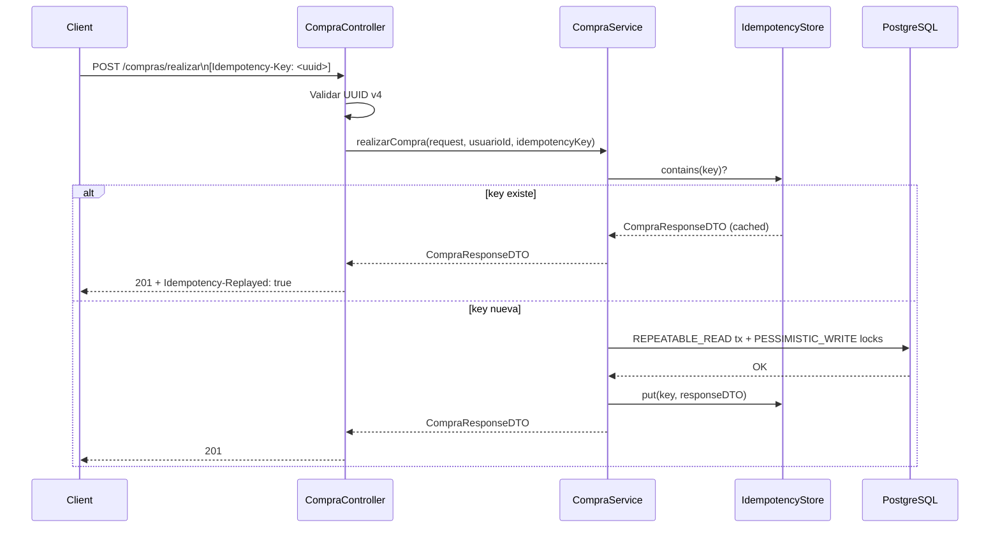

# Documento de Diseño Técnico

## Feature: transacciones-cache-optimizacion

---

## Overview

Este documento describe el diseño técnico para cuatro mejoras ortogonales sobre la tienda online Spring Boot 4 / Java 25 / PostgreSQL:

1. **Idempotencia** en `POST /compras/realizar` y `PUT /compras/admin/{compraId}/estado` mediante el header HTTP `Idempotency-Key`.
2. **Refuerzo ACID** en `CompraService` y `ProductoService`: nivel de aislamiento `REPEATABLE_READ`, bloqueo pesimista, `saveAll` en lugar de `save` dentro de loops, y `@Transactional(readOnly = true)` en métodos de consulta.
3. **Caché en memoria con Caffeine** para las tres regiones de consulta de productos: `productos`, `busquedaProductos` y `productoPorId`.
4. **Corrección N+1** en entidades JPA (`FetchType.LAZY`), repositorios (`countQuery` en queries paginadas) y servicio (`buscarProductosAvanzado` con filtro en BD en lugar de en memoria).

Las cuatro mejoras son independientes entre sí y pueden desplegarse juntas sin conflictos. Ninguna requiere cambios de esquema de base de datos.

---

## Architecture

```mermaid
graph TD
    subgraph HTTP Layer
        CC[CompraController]
        PC[ProductoController]
    end

    subgraph Service Layer
        CS[CompraService]
        PS[ProductoService]
        IS[IdempotencyStore]
    end

    subgraph Cache Layer
        CM[CacheConfig / CaffeineCacheManager]
        C1[Cache: productos]
        C2[Cache: busquedaProductos]
        C3[Cache: productoPorId]
    end

    subgraph Repository Layer
        CR[CompraRepository]
        PR[ProductoRepository]
    end

    subgraph DB
        PG[(PostgreSQL)]
    end

    CC -->|Idempotency-Key header| CS
    CS -->|check / store| IS
    CS --> CR
    CS --> PR

    PC --> PS
    PS -->|@Cacheable| CM
    CM --> C1
    CM --> C2
    CM --> C3
    PS --> PR

    CR --> PG
    PR --> PG
```

**Flujo de idempotencia (realizarCompra):**



---

## Components and Interfaces

### 1. `CacheConfig.java` (nuevo)

Clase `@Configuration` que declara el bean `CaffeineCacheManager` con las tres regiones. Lee TTL y tamaños desde `application.properties` mediante `@Value`.

```java
@Configuration
@EnableCaching
public class CacheConfig {

    @Value("${cache.productos.ttl-minutes:10}")
    private long productosTtlMinutes;

    @Value("${cache.productos.max-size:100}")
    private long productosMaxSize;

    @Value("${cache.busqueda-productos.ttl-minutes:5}")
    private long busquedaTtlMinutes;

    @Value("${cache.busqueda-productos.max-size:200}")
    private long busquedaMaxSize;

    @Value("${cache.producto-por-id.ttl-minutes:10}")
    private long productoPorIdTtlMinutes;

    @Value("${cache.producto-por-id.max-size:500}")
    private long productoPorIdMaxSize;

    @Bean
    public CacheManager cacheManager() {
        CaffeineCacheManager manager = new CaffeineCacheManager();
        manager.setCacheNames(List.of("productos", "busquedaProductos", "productoPorId"));
        // Cada región se configura con su propio Caffeine spec
        // Ver sección Data Models para los specs completos
        return manager;
    }
}
```

> **Decisión de diseño**: Se usa `CaffeineCacheManager` con configuración por región en lugar de `SimpleCacheManager` para poder definir TTL y tamaño máximo independientes por región. Si la dependencia Caffeine no está en el classpath, Spring Boot auto-configura `ConcurrentMapCacheManager` como fallback (Requirement 12.4).

### 2. `IdempotencyStore.java` (nuevo)

Componente `@Component` respaldado por un `Cache` de Caffeine con TTL de 24 horas. Expone tres métodos:

```java
@Component
public class IdempotencyStore {
    private final Cache<String, CompraResponseDTO> store;

    public IdempotencyStore(
            @Value("${idempotency.ttl-hours:24}") long ttlHours,
            @Value("${idempotency.max-size:10000}") long maxSize) {
        this.store = Caffeine.newBuilder()
                .expireAfterWrite(ttlHours, TimeUnit.HOURS)
                .maximumSize(maxSize)
                .build();
    }

    public Optional<CompraResponseDTO> get(String key) { ... }
    public void put(String key, CompraResponseDTO response) { ... }
    public boolean contains(String key) { ... }
}
```

> **Decisión de diseño**: `IdempotencyStore` usa directamente la API de Caffeine (no Spring Cache) porque necesita TTL de 24 horas independiente del `CacheManager` de productos, y porque la semántica de `get-or-compute` de Spring Cache no encaja con el patrón de idempotencia (necesitamos distinguir "clave presente" de "clave ausente" antes de ejecutar la lógica de negocio).

### 3. `TiendaOnlineApplication.java` (modificado)

Agregar `@EnableCaching` a nivel de clase. La anotación puede colocarse también en `CacheConfig`, pero ponerla en la clase principal es más visible.

### 4. `CompraController.java` (modificado)

Ambos endpoints reciben el header `Idempotency-Key` como parámetro opcional a nivel de método:

```java
@PostMapping("/realizar")
public ResponseEntity<CompraResponseDTO> realizarCompra(
        @Valid @RequestBody CompraRequestDTO requestDTO,
        @RequestHeader(value = "Idempotency-Key", required = false) String idempotencyKey) {
    // 1. Validar presencia
    if (idempotencyKey == null || idempotencyKey.isBlank()) {
        return ResponseEntity.badRequest().body(...);
    }
    // 2. Validar formato UUID v4
    if (!isValidUuidV4(idempotencyKey)) {
        return ResponseEntity.badRequest().body(...);
    }
    UUID usuarioId = obtenerIdUsuarioAutenticado();
    CompraResponseDTO response = compraService.realizarCompra(requestDTO, usuarioId, idempotencyKey);
    // 3. Añadir header de replay si aplica
    HttpHeaders headers = new HttpHeaders();
    if (compraService.wasReplayed(idempotencyKey)) {
        headers.add("Idempotency-Replayed", "true");
    }
    return new ResponseEntity<>(response, headers, HttpStatus.CREATED);
}
```

> **Decisión de diseño alternativa**: En lugar de un método `wasReplayed()` en el servicio, el servicio puede retornar un wrapper `IdempotencyResult<CompraResponseDTO>` que incluya un flag `replayed`. Esto evita una segunda consulta al store y es más limpio. Se adopta este enfoque en la implementación.

### 5. `CompraService.java` (modificado)

Cambios por método:

| Método | Cambios |
|---|---|
| `realizarCompra` | `@Transactional(isolation=REPEATABLE_READ)`, idempotency check, `findByIdWithLock`, acumulación en `Map`, `saveAll` post-loop, `idempotencyStore.put` |
| `cancelarCompra` | `@Transactional(isolation=REPEATABLE_READ)`, `findByIdWithLock`, acumulación en `Map`, `saveAll` post-loop |
| `putEstadoCompra` | idempotency check, `idempotencyStore.put` |
| `getMisCompras` | `@Transactional(readOnly=true)` |
| `getCompraById` | `@Transactional(readOnly=true)` |
| `getAllCompras` | `@Transactional(readOnly=true)` |

Patrón de acumulación en `realizarCompra`:

```java
Map<UUID, ProductoEntity> modifiedProducts = new LinkedHashMap<>();
for (CompraRequestDTO.ItemCompraDTO item : request.getItems()) {
    ProductoEntity producto = productoRepository.findByIdWithLock(item.getIdProducto())
            .orElseThrow(() -> new BusinessRuleException("Producto no encontrado: " + item.getIdProducto()));
    if (producto.getStockProducto() < item.getCantidad()) {
        throw new BusinessRuleException("Stock insuficiente: " + producto.getNombreProducto());
    }
    producto.setStockProducto(producto.getStockProducto() - item.getCantidad());
    modifiedProducts.put(producto.getIdProducto(), producto);
    // crear detalle...
}
productoRepository.saveAll(modifiedProducts.values()); // una sola llamada
```

### 6. `ProductoService.java` (modificado)

Cambios por método:

| Método | Cambios |
|---|---|
| `getProductos` | `@Transactional(readOnly=true)`, `@Cacheable("productos", key=...)` |
| `buscarProductosPorTermino` | `@Transactional(readOnly=true)`, `@Cacheable("busquedaProductos", key=...)` |
| `buscarProductosPorNombre` | `@Transactional(readOnly=true)`, `@Cacheable("busquedaProductos", key=...)` |
| `buscarProductosAvanzado` | `@Transactional(readOnly=true)`, `@Cacheable("busquedaProductos", key=...)`, reemplazar filtro en memoria con `productoRepository.buscarPorCategoria(categoriaId, pageable)` |
| `getProductoById` | `@Transactional(readOnly=true)`, `@Cacheable("productoPorId", key="#idProducto")` |
| `crearProducto` | `@CacheEvict(value={"productos","busquedaProductos"}, allEntries=true)` |
| `actualizarProducto` | `@CacheEvict` en `productos` y `busquedaProductos` (allEntries), `@CacheEvict` en `productoPorId` (key=#idProducto) |
| `eliminarProducto` | igual que `actualizarProducto` |

> **Decisión de diseño**: Para `actualizarProducto` y `eliminarProducto` se necesitan dos `@CacheEvict` con configuraciones distintas (allEntries vs key específica). Se usa `@Caching` para agruparlos:
> ```java
> @Caching(evict = {
>     @CacheEvict(value = {"productos", "busquedaProductos"}, allEntries = true),
>     @CacheEvict(value = "productoPorId", key = "#idProducto")
> })
> ```

### 7. `CompraEntity.java` (modificado)

```java
// Antes:
@OneToMany(mappedBy = "compra", cascade = CascadeType.ALL, fetch = FetchType.EAGER, orphanRemoval = true)
// Después:
@OneToMany(mappedBy = "compra", cascade = CascadeType.ALL, fetch = FetchType.LAZY, orphanRemoval = true)
```

### 8. `CompraDetalleEntity.java` (modificado)

```java
// Antes:
@ManyToOne(fetch = FetchType.EAGER)
private CompraEntity compra;

@ManyToOne(fetch = FetchType.EAGER)
private ProductoEntity producto;

// Después:
@ManyToOne(fetch = FetchType.LAZY)
private CompraEntity compra;

@ManyToOne(fetch = FetchType.LAZY)
private ProductoEntity producto;
```

### 9. `CompraRepository.java` (modificado)

Agregar `countQuery` a las cuatro queries paginadas y agregar `findByIdWithLock`:

```java
@Lock(LockModeType.PESSIMISTIC_WRITE)
@Query("SELECT p FROM ProductoEntity p WHERE p.idProducto = :id")
Optional<ProductoEntity> findByIdWithLock(@Param("id") UUID id);
```

> **Nota**: `findByIdWithLock` se declara en `ProductoRepository`, no en `CompraRepository`, ya que opera sobre `ProductoEntity`.

### 10. `ProductoRepository.java` (modificado)

Agregar `countQuery` a todas las queries paginadas y agregar `buscarPorCategoria`:

```java
@Query(value = "SELECT p FROM ProductoEntity p JOIN FETCH p.categoria JOIN FETCH p.usuario " +
               "WHERE p.categoria.idCategoria = :categoriaId",
       countQuery = "SELECT COUNT(p) FROM ProductoEntity p WHERE p.categoria.idCategoria = :categoriaId")
Page<ProductoEntity> buscarPorCategoria(@Param("categoriaId") UUID categoriaId, Pageable pageable);
```

### 11. `pom.xml` (modificado)

Agregar dos dependencias:

```xml
<dependency>
    <groupId>org.springframework.boot</groupId>
    <artifactId>spring-boot-starter-cache</artifactId>
</dependency>
<dependency>
    <groupId>com.github.ben-manes.caffeine</groupId>
    <artifactId>caffeine</artifactId>
    <version>3.1.8</version>
</dependency>
```

> **Decisión de versión**: Se usa Caffeine 3.1.8 (la versión más reciente estable compatible con Java 11+). La versión 2.9.3 mencionada en el contexto es la rama 2.x (Java 8); dado que el proyecto usa Java 25, se prefiere la rama 3.x que aprovecha las APIs modernas de Java.

### 12. `application.properties` (modificado)

```properties
# Cache - región productos
cache.productos.ttl-minutes=10
cache.productos.max-size=100

# Cache - región busquedaProductos
cache.busqueda-productos.ttl-minutes=5
cache.busqueda-productos.max-size=200

# Cache - región productoPorId
cache.producto-por-id.ttl-minutes=10
cache.producto-por-id.max-size=500

# IdempotencyStore
idempotency.ttl-hours=24
idempotency.max-size=10000
```

---

## Data Models

### IdempotencyStore — estructura interna

```
ConcurrentHashMap (gestionado por Caffeine):
  key   : String  (UUID v4 del header Idempotency-Key)
  value : CompraResponseDTO
  TTL   : 24 horas (expireAfterWrite)
  max   : 10 000 entradas
```

### Caffeine Cache Specs por región

| Región | TTL | Max entries | Uso |
|---|---|---|---|
| `productos` | 10 min | 100 | `getProductos(pagina, tamanio)` |
| `busquedaProductos` | 5 min | 200 | `buscarPorTermino`, `buscarPorNombre`, `buscarProductosAvanzado` |
| `productoPorId` | 10 min | 500 | `getProductoById(idProducto)` |

### Claves de caché

| Método | Clave Spring Cache SpEL |
|---|---|
| `getProductos(pagina, tamanio)` | `"#pagina + '-' + #tamanio"` |
| `buscarProductosPorTermino(termino, pagina, tamanio)` | `"#termino + '-' + #pagina + '-' + #tamanio"` |
| `buscarProductosPorNombre(nombre, pagina, tamanio)` | `"#nombre + '-' + #pagina + '-' + #tamanio"` |
| `buscarProductosAvanzado(dto)` | `"#productoBusquedaDTO.termino + '-' + #productoBusquedaDTO.categoriaId + '-' + #productoBusquedaDTO.pagina + '-' + #productoBusquedaDTO.tamanio"` |
| `getProductoById(idProducto)` | `"#idProducto"` |

### Wrapper de resultado idempotente

```java
public record IdempotencyResult<T>(T data, boolean replayed) {}
```

`CompraService.realizarCompra` y `putEstadoCompra` retornan `IdempotencyResult<CompraResponseDTO>`. El controlador lee el flag `replayed` para añadir el header `Idempotency-Replayed: true`.

---

## Correctness Properties

*Una propiedad es una característica o comportamiento que debe mantenerse verdadero en todas las ejecuciones válidas del sistema — esencialmente, una declaración formal sobre lo que el sistema debe hacer. Las propiedades sirven como puente entre las especificaciones legibles por humanos y las garantías de corrección verificables por máquina.*

---

### Property 1: Idempotencia del store — round trip

*Para cualquier* clave de idempotencia `k` y cualquier `CompraResponseDTO` `r`, si se almacena `put(k, r)` y luego se consulta `get(k)`, el resultado debe ser igual a `r`.

**Validates: Requirements 1.2, 1.3, 2.2, 2.3**

---

### Property 2: Idempotencia del store — primera escritura gana

*Para cualquier* clave `k`, si se almacena `put(k, r1)` y luego `put(k, r2)` con `r1 ≠ r2`, entonces `get(k)` debe retornar `r1` (la primera respuesta almacenada), no `r2`.

**Validates: Requirements 1.2, 2.2**

---

### Property 3: Header Idempotency-Replayed en respuestas repetidas

*Para cualquier* clave `k` que ya existe en el `IdempotencyStore`, cuando el controlador procesa una solicitud con esa clave, la respuesta HTTP debe incluir el header `Idempotency-Replayed: true`.

**Validates: Requirements 1.7**

---

### Property 4: Validación de formato UUID v4

*Para cualquier* cadena que no sea un UUID v4 válido (incluyendo cadenas vacías, UUIDs v1/v3/v5, cadenas arbitrarias), el controlador debe retornar HTTP 400.

**Validates: Requirements 1.5**

---

### Property 5: Atomicidad en realizarCompra — stock invariante ante fallo

*Para cualquier* solicitud de compra donde al menos un ítem tiene stock insuficiente, después de que `realizarCompra` lanza una excepción, el stock de todos los productos involucrados debe ser idéntico al stock previo a la llamada.

**Validates: Requirements 3.3**

---

### Property 6: saveAll exactamente una vez por producto modificado en realizarCompra

*Para cualquier* lista de N ítems con productos distintos, `realizarCompra` debe invocar `productoRepository.saveAll()` exactamente una vez con exactamente N entidades, y no debe invocar `productoRepository.save()` dentro del loop de procesamiento de ítems.

**Validates: Requirements 3.2**

---

### Property 7: saveAll exactamente una vez por producto en cancelarCompra

*Para cualquier* compra con N detalles de productos distintos, `cancelarCompra` debe invocar `productoRepository.saveAll()` exactamente una vez con exactamente N entidades, y no debe invocar `productoRepository.save()` dentro del loop.

**Validates: Requirements 4.2**

---

### Property 8: Cache hit en getProductos — una sola consulta BD para llamadas repetidas

*Para cualquier* par `(pagina, tamanio)` válido, invocar `getProductos(pagina, tamanio)` dos veces consecutivas debe resultar en exactamente una consulta a la base de datos (la segunda llamada se sirve desde caché).

**Validates: Requirements 7.2, 7.3**

---

### Property 9: Cache hit en búsquedas de productos

*Para cualquier* combinación de parámetros de búsqueda `(termino, pagina, tamanio)`, `(nombre, pagina, tamanio)` o `ProductoBusquedaDTO`, invocar el método de búsqueda correspondiente dos veces consecutivas debe resultar en exactamente una consulta a la base de datos.

**Validates: Requirements 8.1, 8.2, 8.3**

---

### Property 10: Cache hit en getProductoById

*Para cualquier* `idProducto` válido, invocar `getProductoById(idProducto)` dos veces consecutivas debe resultar en exactamente una consulta a la base de datos.

**Validates: Requirements 9.1, 9.2**

---

### Property 11: Evicción de caché tras modificación de producto

*Para cualquier* producto, después de ejecutar `crearProducto`, `actualizarProducto` o `eliminarProducto` exitosamente, la siguiente llamada a `getProductos` o a cualquier método de búsqueda debe ejecutar una consulta a la base de datos (la caché fue invalidada).

**Validates: Requirements 7.5, 8.5**

---

### Property 12: Evicción selectiva de productoPorId tras actualización o eliminación

*Para cualquier* `idProducto`, después de ejecutar `actualizarProducto(idProducto, ...)` o `eliminarProducto(idProducto, ...)`, la siguiente llamada a `getProductoById(idProducto)` debe ejecutar una consulta a la base de datos (la entrada específica fue invalidada).

**Validates: Requirements 9.4, 9.5**

---

### Property 13: Corrección del filtro por categoría en buscarProductosAvanzado

*Para cualquier* `categoriaId` válido, todos los productos retornados por `buscarProductosAvanzado` cuando solo se proporciona `categoriaId` deben tener `categoria.idCategoria == categoriaId`. No debe retornarse ningún producto de otra categoría.

**Validates: Requirements 11.3, 11.4**

---

### Property 14: Una sola consulta SQL al cargar compra con detalles

*Para cualquier* `compraId` válido, invocar `compraRepository.findByIdWithDetails(compraId)` debe generar exactamente una consulta SQL (sin consultas adicionales al acceder a `detalles`, `producto`, `idMetodoPago` o `usuario`).

**Validates: Requirements 10.4**

---

## Error Handling

### Validación de Idempotency-Key en el controlador

| Condición | Respuesta |
|---|---|
| Header ausente o en blanco | HTTP 400, body: `{"error": "El header Idempotency-Key es obligatorio"}` |
| Valor no es UUID v4 válido | HTTP 400, body: `{"error": "El header Idempotency-Key debe ser un UUID v4 válido"}` |

La validación se realiza en el controlador antes de llamar al servicio, usando un método utilitario `isValidUuidV4(String)` que compila el patrón UUID v4 una sola vez como constante estática.

### Excepciones en transacciones REPEATABLE_READ

- `BusinessRuleException` (stock insuficiente, producto no encontrado): Spring marca la transacción para rollback automático. El stock queda intacto.
- `OptimisticLockException` / `PessimisticLockException`: propagadas al controlador, que las mapea a HTTP 409 Conflict mediante el `GlobalExceptionHandler` existente.
- `DataIntegrityViolationException` (número de compra duplicado en race condition): propagada al controlador → HTTP 409.

### Caché — degradación graceful

Si Caffeine no está en el classpath, Spring Boot usa `ConcurrentMapCacheManager` automáticamente. Las anotaciones `@Cacheable` / `@CacheEvict` siguen funcionando sin TTL. No se lanza ninguna excepción en startup.

### IdempotencyStore — comportamiento ante concurrencia

Caffeine garantiza que `put` es atómico. Si dos hilos llaman `put(k, r1)` y `put(k, r2)` simultáneamente para la misma clave nueva, uno de los dos ganará. La semántica de "primera escritura gana" se implementa usando `Cache.get(key, loader)` con un loader que ejecuta la lógica de negocio, garantizando que el loader se ejecuta como máximo una vez por clave.

---

## Testing Strategy

### Enfoque dual

Se combinan **tests unitarios** (ejemplos concretos, casos borde, verificación de configuración) con **tests de propiedades** (cobertura universal mediante generación aleatoria de inputs).

### Librería de property-based testing

Se usa **[jqwik](https://jqwik.net/)** como librería PBT para Java. Es la opción más madura para el ecosistema Java/JUnit 5, con soporte nativo para generadores de tipos Java estándar (UUID, String, Integer, colecciones) y fácil integración con Spring Boot Test.

Dependencia a agregar en `pom.xml` (scope test):

```xml
<dependency>
    <groupId>net.jqwik</groupId>
    <artifactId>jqwik</artifactId>
    <version>1.8.4</version>
    <scope>test</scope>
</dependency>
```

Cada property test se configura con mínimo 100 iteraciones (`@Property(tries = 100)`).

### Tests de propiedades (PBT)

Cada propiedad del diseño se implementa como un test `@Property` en jqwik:

| Propiedad | Clase de test | Descripción |
|---|---|---|
| Property 1 | `IdempotencyStorePropertyTest` | Round trip: `put(k,r); get(k) == r` |
| Property 2 | `IdempotencyStorePropertyTest` | Primera escritura gana: `put(k,r1); put(k,r2); get(k) == r1` |
| Property 3 | `CompraControllerPropertyTest` | Header `Idempotency-Replayed: true` en respuestas repetidas |
| Property 4 | `CompraControllerPropertyTest` | Strings no-UUID → HTTP 400 |
| Property 5 | `CompraServicePropertyTest` | Stock invariante ante fallo de atomicidad |
| Property 6 | `CompraServicePropertyTest` | `saveAll` exactamente una vez en `realizarCompra` |
| Property 7 | `CompraServicePropertyTest` | `saveAll` exactamente una vez en `cancelarCompra` |
| Property 8 | `ProductoServiceCachePropertyTest` | Cache hit en `getProductos` |
| Property 9 | `ProductoServiceCachePropertyTest` | Cache hit en búsquedas |
| Property 10 | `ProductoServiceCachePropertyTest` | Cache hit en `getProductoById` |
| Property 11 | `ProductoServiceCachePropertyTest` | Evicción tras modificación |
| Property 12 | `ProductoServiceCachePropertyTest` | Evicción selectiva por ID |
| Property 13 | `ProductoRepositoryPropertyTest` | Filtro por categoría correcto |
| Property 14 | `CompraRepositoryPropertyTest` | Una sola query SQL al cargar compra |

**Tag format**: Cada test incluye un comentario de referencia:
```java
// Feature: transacciones-cache-optimizacion, Property 1: IdempotencyStore round trip
```

### Tests unitarios (ejemplos concretos)

- `CompraControllerTest`: POST sin header → 400; POST con header inválido → 400; PUT sin header → 400.
- `CompraServiceTest`: `realizarCompra` con stock suficiente → compra creada; `cancelarCompra` en estado PENDIENTE → estado CANCELADO.
- `ProductoServiceTest`: `crearProducto` → caché eviccionada; `getProductoById` → DTO correcto.
- `CacheConfigTest`: contexto Spring carga los tres beans de caché con TTL y tamaño correctos.

### Tests de integración

- `CompraServiceIntegrationTest`: dos hilos concurrentes comprando el mismo producto con stock = 1 → solo una compra exitosa, stock final = 0.
- `ProductoRepositoryIntegrationTest`: `buscarPorCategoria` con datos reales → todos los resultados pertenecen a la categoría solicitada.

### Cobertura de smoke tests

Los siguientes aspectos se verifican mediante tests de contexto Spring (`@SpringBootTest`):

- `CaffeineCacheManager` bean presente con las tres regiones.
- `@Transactional(readOnly=true)` en los cinco métodos de `ProductoService`.
- `@Transactional(readOnly=true)` en los tres métodos de `CompraService`.
- `FetchType.LAZY` en `CompraEntity.detalles`, `CompraDetalleEntity.compra` y `CompraDetalleEntity.producto`.
- `countQuery` presente en las queries paginadas de `CompraRepository` y `ProductoRepository`.
