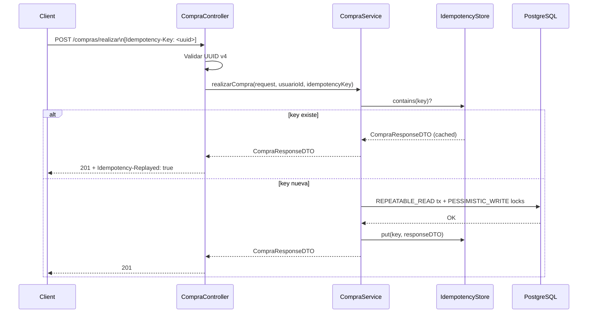
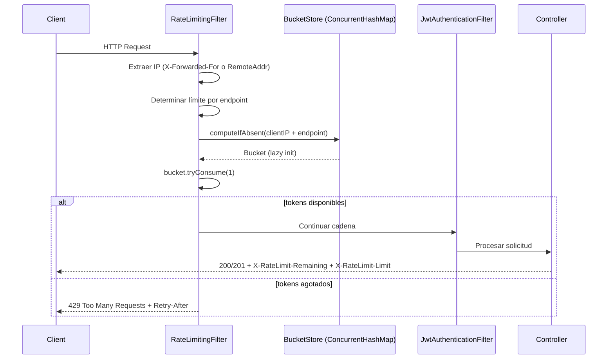

# Documento de Diseño Técnico

## Feature: transacciones-cache-optimizacion

---

## Overview

Este documento describe el diseño técnico para cinco mejoras ortogonales sobre la tienda online Spring Boot 4 / Java 25 / PostgreSQL:

1. **Idempotencia** en `POST /compras/realizar` y `PUT /compras/admin/{compraId}/estado` mediante el header HTTP `Idempotency-Key`.
2. **Refuerzo ACID** en `CompraService` y `ProductoService`: nivel de aislamiento `REPEATABLE_READ`, bloqueo pesimista, `saveAll` en lugar de `save` dentro de loops, y `@Transactional(readOnly = true)` en métodos de consulta.
3. **Caché en memoria con Caffeine** para las tres regiones de consulta de productos: `productos`, `busquedaProductos` y `productoPorId`.
4. **Corrección N+1** en entidades JPA (`FetchType.LAZY`), repositorios (`countQuery` en queries paginadas) y servicio (`buscarProductosAvanzado` con filtro en BD en lugar de en memoria).
5. **Rate Limiting** en endpoints HTTP mediante la librería `bucket4j` con almacenamiento en memoria (`ConcurrentHashMap`), aplicando límites por IP y endpoint antes de la capa de autenticación.

Las cinco mejoras son independientes entre sí y pueden desplegarse juntas sin conflictos. Ninguna requiere cambios de esquema de base de datos.

---

## Architecture

```mermaid
graph TD
    subgraph Filter Layer
        RLF[RateLimitingFilter]
        JAF[JwtAuthenticationFilter]
    end

    subgraph HTTP Layer
        CC[CompraController]
        PC[ProductoController]
        AC[AuthController]
        UC[UsuarioController]
    end

    subgraph Service Layer
        CS[CompraService]
        PS[ProductoService]
        IS[IdempotencyStore]
    end

    subgraph Cache Layer
        CM[CacheConfig / CaffeineCacheManager]
        C1[Cache: productos]
        C2[Cache: busquedaProductos]
        C3[Cache: productoPorId]
    end

    subgraph Repository Layer
        CR[CompraRepository]
        PR[ProductoRepository]
    end

    subgraph DB
        PG[(PostgreSQL)]
    end

    RLF -->|HTTP 429 if exceeded| Client
    RLF -->|dentro del límite| JAF
    JAF --> CC
    JAF --> PC
    JAF --> AC
    JAF --> UC

    CC -->|Idempotency-Key header| CS
    CS -->|check / store| IS
    CS --> CR
    CS --> PR

    PC --> PS
    PS -->|@Cacheable| CM
    CM --> C1
    CM --> C2
    CM --> C3
    PS --> PR

    CR --> PG
    PR --> PG
```

**Flujo de idempotencia (realizarCompra):**



**Flujo de Rate Limiting:**



---

## Components and Interfaces

### 1. `CacheConfig.java` (nuevo)

Clase `@Configuration` que declara el bean `CaffeineCacheManager` con las tres regiones. Lee TTL y tamaños desde `application.properties` mediante `@Value`.

```java
@Configuration
@EnableCaching
public class CacheConfig {

    @Value("${cache.productos.ttl-minutes:10}")
    private long productosTtlMinutes;

    @Value("${cache.productos.max-size:100}")
    private long productosMaxSize;

    @Value("${cache.busqueda-productos.ttl-minutes:5}")
    private long busquedaTtlMinutes;

    @Value("${cache.busqueda-productos.max-size:200}")
    private long busquedaMaxSize;

    @Value("${cache.producto-por-id.ttl-minutes:10}")
    private long productoPorIdTtlMinutes;

    @Value("${cache.producto-por-id.max-size:500}")
    private long productoPorIdMaxSize;

    @Bean
    public CacheManager cacheManager() {
        CaffeineCacheManager manager = new CaffeineCacheManager();
        manager.setCacheNames(List.of("productos", "busquedaProductos", "productoPorId"));
        // Cada región se configura con su propio Caffeine spec
        // Ver sección Data Models para los specs completos
        return manager;
    }
}
```

> **Decisión de diseño**: Se usa `CaffeineCacheManager` con configuración por región en lugar de `SimpleCacheManager` para poder definir TTL y tamaño máximo independientes por región. Si la dependencia Caffeine no está en el classpath, Spring Boot auto-configura `ConcurrentMapCacheManager` como fallback (Requirement 12.4).

### 2. `IdempotencyStore.java` (nuevo)

Componente `@Component` respaldado por un `Cache` de Caffeine con TTL de 24 horas. Expone tres métodos:

```java
@Component
public class IdempotencyStore {
    private final Cache<String, CompraResponseDTO> store;

    public IdempotencyStore(
            @Value("${idempotency.ttl-hours:24}") long ttlHours,
            @Value("${idempotency.max-size:10000}") long maxSize) {
        this.store = Caffeine.newBuilder()
                .expireAfterWrite(ttlHours, TimeUnit.HOURS)
                .maximumSize(maxSize)
                .build();
    }

    public Optional<CompraResponseDTO> get(String key) { ... }
    public void put(String key, CompraResponseDTO response) { ... }
    public boolean contains(String key) { ... }
}
```

> **Decisión de diseño**: `IdempotencyStore` usa directamente la API de Caffeine (no Spring Cache) porque necesita TTL de 24 horas independiente del `CacheManager` de productos, y porque la semántica de `get-or-compute` de Spring Cache no encaja con el patrón de idempotencia (necesitamos distinguir "clave presente" de "clave ausente" antes de ejecutar la lógica de negocio).

### 3. `TiendaOnlineApplication.java` (modificado)

Agregar `@EnableCaching` a nivel de clase. La anotación puede colocarse también en `CacheConfig`, pero ponerla en la clase principal es más visible.

### 4. `CompraController.java` (modificado)

Ambos endpoints reciben el header `Idempotency-Key` como parámetro opcional a nivel de método:

```java
@PostMapping("/realizar")
public ResponseEntity<CompraResponseDTO> realizarCompra(
        @Valid @RequestBody CompraRequestDTO requestDTO,
        @RequestHeader(value = "Idempotency-Key", required = false) String idempotencyKey) {
    // 1. Validar presencia
    if (idempotencyKey == null || idempotencyKey.isBlank()) {
        return ResponseEntity.badRequest().body(...);
    }
    // 2. Validar formato UUID v4
    if (!isValidUuidV4(idempotencyKey)) {
        return ResponseEntity.badRequest().body(...);
    }
    UUID usuarioId = obtenerIdUsuarioAutenticado();
    CompraResponseDTO response = compraService.realizarCompra(requestDTO, usuarioId, idempotencyKey);
    // 3. Añadir header de replay si aplica
    HttpHeaders headers = new HttpHeaders();
    if (compraService.wasReplayed(idempotencyKey)) {
        headers.add("Idempotency-Replayed", "true");
    }
    return new ResponseEntity<>(response, headers, HttpStatus.CREATED);
}
```

> **Decisión de diseño alternativa**: En lugar de un método `wasReplayed()` en el servicio, el servicio puede retornar un wrapper `IdempotencyResult<CompraResponseDTO>` que incluya un flag `replayed`. Esto evita una segunda consulta al store y es más limpio. Se adopta este enfoque en la implementación.

### 5. `CompraService.java` (modificado)

Cambios por método:

| Método | Cambios |
|---|---|
| `realizarCompra` | `@Transactional(isolation=REPEATABLE_READ)`, idempotency check, `findByIdWithLock`, acumulación en `Map`, `saveAll` post-loop, `idempotencyStore.put` |
| `cancelarCompra` | `@Transactional(isolation=REPEATABLE_READ)`, `findByIdWithLock`, acumulación en `Map`, `saveAll` post-loop |
| `putEstadoCompra` | idempotency check, `idempotencyStore.put` |
| `getMisCompras` | `@Transactional(readOnly=true)` |
| `getCompraById` | `@Transactional(readOnly=true)` |
| `getAllCompras` | `@Transactional(readOnly=true)` |

Patrón de acumulación en `realizarCompra`:

```java
Map<UUID, ProductoEntity> modifiedProducts = new LinkedHashMap<>();
for (CompraRequestDTO.ItemCompraDTO item : request.getItems()) {
    ProductoEntity producto = productoRepository.findByIdWithLock(item.getIdProducto())
            .orElseThrow(() -> new BusinessRuleException("Producto no encontrado: " + item.getIdProducto()));
    if (producto.getStockProducto() < item.getCantidad()) {
        throw new BusinessRuleException("Stock insuficiente: " + producto.getNombreProducto());
    }
    producto.setStockProducto(producto.getStockProducto() - item.getCantidad());
    modifiedProducts.put(producto.getIdProducto(), producto);
    // crear detalle...
}
productoRepository.saveAll(modifiedProducts.values()); // una sola llamada
```

### 6. `ProductoService.java` (modificado)

Cambios por método:

| Método | Cambios |
|---|---|
| `getProductos` | `@Transactional(readOnly=true)`, `@Cacheable("productos", key=...)` |
| `buscarProductosPorTermino` | `@Transactional(readOnly=true)`, `@Cacheable("busquedaProductos", key=...)` |
| `buscarProductosPorNombre` | `@Transactional(readOnly=true)`, `@Cacheable("busquedaProductos", key=...)` |
| `buscarProductosAvanzado` | `@Transactional(readOnly=true)`, `@Cacheable("busquedaProductos", key=...)`, reemplazar filtro en memoria con `productoRepository.buscarPorCategoria(categoriaId, pageable)` |
| `getProductoById` | `@Transactional(readOnly=true)`, `@Cacheable("productoPorId", key="#idProducto")` |
| `crearProducto` | `@CacheEvict(value={"productos","busquedaProductos"}, allEntries=true)` |
| `actualizarProducto` | `@CacheEvict` en `productos` y `busquedaProductos` (allEntries), `@CacheEvict` en `productoPorId` (key=#idProducto) |
| `eliminarProducto` | igual que `actualizarProducto` |

> **Decisión de diseño**: Para `actualizarProducto` y `eliminarProducto` se necesitan dos `@CacheEvict` con configuraciones distintas (allEntries vs key específica). Se usa `@Caching` para agruparlos:
> ```java
> @Caching(evict = {
>     @CacheEvict(value = {"productos", "busquedaProductos"}, allEntries = true),
>     @CacheEvict(value = "productoPorId", key = "#idProducto")
> })
> ```

### 7. `CompraEntity.java` (modificado)

```java
// Antes:
@OneToMany(mappedBy = "compra", cascade = CascadeType.ALL, fetch = FetchType.EAGER, orphanRemoval = true)
// Después:
@OneToMany(mappedBy = "compra", cascade = CascadeType.ALL, fetch = FetchType.LAZY, orphanRemoval = true)
```

### 8. `CompraDetalleEntity.java` (modificado)

```java
// Antes:
@ManyToOne(fetch = FetchType.EAGER)
private CompraEntity compra;

@ManyToOne(fetch = FetchType.EAGER)
private ProductoEntity producto;

// Después:
@ManyToOne(fetch = FetchType.LAZY)
private CompraEntity compra;

@ManyToOne(fetch = FetchType.LAZY)
private ProductoEntity producto;
```

### 9. `CompraRepository.java` (modificado)

Agregar `countQuery` a las cuatro queries paginadas y agregar `findByIdWithLock`:

```java
@Lock(LockModeType.PESSIMISTIC_WRITE)
@Query("SELECT p FROM ProductoEntity p WHERE p.idProducto = :id")
Optional<ProductoEntity> findByIdWithLock(@Param("id") UUID id);
```

> **Nota**: `findByIdWithLock` se declara en `ProductoRepository`, no en `CompraRepository`, ya que opera sobre `ProductoEntity`.

### 10. `ProductoRepository.java` (modificado)

Agregar `countQuery` a todas las queries paginadas y agregar `buscarPorCategoria`:

```java
@Query(value = "SELECT p FROM ProductoEntity p JOIN FETCH p.categoria JOIN FETCH p.usuario " +
               "WHERE p.categoria.idCategoria = :categoriaId",
       countQuery = "SELECT COUNT(p) FROM ProductoEntity p WHERE p.categoria.idCategoria = :categoriaId")
Page<ProductoEntity> buscarPorCategoria(@Param("categoriaId") UUID categoriaId, Pageable pageable);
```

### 11. `pom.xml` (modificado)

Agregar dos dependencias:

```xml
<dependency>
    <groupId>org.springframework.boot</groupId>
    <artifactId>spring-boot-starter-cache</artifactId>
</dependency>
<dependency>
    <groupId>com.github.ben-manes.caffeine</groupId>
    <artifactId>caffeine</artifactId>
    <version>3.1.8</version>
</dependency>
<dependency>
    <groupId>com.bucket4j</groupId>
    <artifactId>bucket4j-core</artifactId>
    <version>8.10.1</version>
</dependency>
```

> **Decisión de versión**: Se usa Caffeine 3.1.8 (la versión más reciente estable compatible con Java 11+). La versión 2.9.3 mencionada en el contexto es la rama 2.x (Java 8); dado que el proyecto usa Java 25, se prefiere la rama 3.x que aprovecha las APIs modernas de Java. Para bucket4j se usa la versión 8.10.1 (última versión estable compatible con Java 17+).

### 12. `application.properties` (modificado)

```properties
# Cache - región productos
cache.productos.ttl-minutes=10
cache.productos.max-size=100

# Cache - región busquedaProductos
cache.busqueda-productos.ttl-minutes=5
cache.busqueda-productos.max-size=200

# Cache - región productoPorId
cache.producto-por-id.ttl-minutes=10
cache.producto-por-id.max-size=500

# IdempotencyStore
idempotency.ttl-hours=24
idempotency.max-size=10000

# Rate Limiting
rate-limit.auth.requests=10
rate-limit.auth.duration-minutes=1
rate-limit.productos.requests=100
rate-limit.productos.duration-minutes=1
rate-limit.compras.requests=30
rate-limit.compras.duration-minutes=1
rate-limit.usuarios.requests=20
rate-limit.usuarios.duration-minutes=1
```

---

### 13. `RateLimitingFilter.java` (nuevo)

Filtro que implementa Rate Limiting con `bucket4j` y se registra antes del `JwtAuthenticationFilter` en la cadena de seguridad.

```java
@Component
public class RateLimitingFilter extends OncePerRequestFilter {

    private final ConcurrentHashMap<String, Bucket> buckets = new ConcurrentHashMap<>();

    @Value("${rate-limit.auth.requests:10}")
    private int authRequests;

    @Value("${rate-limit.auth.duration-minutes:1}")
    private int authDuration;

    @Value("${rate-limit.productos.requests:100}")
    private int productosRequests;

    @Value("${rate-limit.productos.duration-minutes:1}")
    private int productosDuration;

    @Value("${rate-limit.compras.requests:30}")
    private int comprasRequests;

    @Value("${rate-limit.compras.duration-minutes:1}")
    private int comprasDuration;

    @Value("${rate-limit.usuarios.requests:20}")
    private int usuariosRequests;

    @Value("${rate-limit.usuarios.duration-minutes:1}")
    private int usuariosDuration;

    @Override
    protected void doFilterInternal(HttpServletRequest request,
                                     HttpServletResponse response,
                                     FilterChain filterChain) throws ServletException, IOException {
        String clientIp = extractClientIp(request);
        String endpoint = determineEndpoint(request.getRequestURI());
        String bucketKey = clientIp + ":" + endpoint;

        Bucket bucket = buckets.computeIfAbsent(bucketKey, k -> createBucket(endpoint));
        ConsumptionProbe probe = bucket.tryConsumeAndReturnRemaining(1);

        if (probe.isConsumed()) {
            response.addHeader("X-RateLimit-Remaining", String.valueOf(probe.getRemainingTokens()));
            response.addHeader("X-RateLimit-Limit", String.valueOf(getLimitForEndpoint(endpoint)));
            filterChain.doFilter(request, response);
        } else {
            long waitForRefill = TimeUnit.NANOSECONDS.toSeconds(probe.getNanosToWaitForRefill());
            response.setStatus(HttpStatus.TOO_MANY_REQUESTS.value());
            response.setContentType(MediaType.APPLICATION_JSON_VALUE);
            response.addHeader("Retry-After", String.valueOf(waitForRefill));
            response.getWriter().write(String.format(
                "{\"error\": \"Too many requests\", \"retryAfterSeconds\": %d}", waitForRefill
            ));
        }
    }

    private String extractClientIp(HttpServletRequest request) {
        String xForwardedFor = request.getHeader("X-Forwarded-For");
        if (xForwardedFor != null && !xForwardedFor.isBlank()) {
            return xForwardedFor.split(",")[0].trim();
        }
        return request.getRemoteAddr();
    }

    private String determineEndpoint(String uri) {
        if (uri.startsWith("/auth/")) return "auth";
        if (uri.startsWith("/productos/")) return "productos";
        if (uri.startsWith("/compras/")) return "compras";
        if (uri.startsWith("/usuarios/")) return "usuarios";
        return "default";
    }

    private Bucket createBucket(String endpoint) {
        Bandwidth limit;
        switch (endpoint) {
            case "auth" -> limit = Bandwidth.simple(authRequests, Duration.ofMinutes(authDuration));
            case "productos" -> limit = Bandwidth.simple(productosRequests, Duration.ofMinutes(productosDuration));
            case "compras" -> limit = Bandwidth.simple(comprasRequests, Duration.ofMinutes(comprasDuration));
            case "usuarios" -> limit = Bandwidth.simple(usuariosRequests, Duration.ofMinutes(usuariosDuration));
            default -> limit = Bandwidth.simple(100, Duration.ofMinutes(1)); // fallback
        }
        return Bucket.builder().addLimit(limit).build();
    }

    private int getLimitForEndpoint(String endpoint) {
        return switch (endpoint) {
            case "auth" -> authRequests;
            case "productos" -> productosRequests;
            case "compras" -> comprasRequests;
            case "usuarios" -> usuariosRequests;
            default -> 100;
        };
    }
}
```

> **Decisión de diseño**: El filtro extiende `OncePerRequestFilter` para garantizar que se ejecute exactamente una vez por petición, incluso en casos de forward/include internos. La clave del bucket combina IP + endpoint para aislar límites entre rutas. Se usa `computeIfAbsent` para garantizar inicialización lazy thread-safe del bucket.

---

### 14. `SecurityConfig.java` (modificado)

Registrar el `RateLimitingFilter` antes del `JwtAuthenticationFilter` en la cadena de filtros:

```java
@Configuration
@EnableWebSecurity
public class SecurityConfig {

    private final JwtAuthenticationFilter jwtAuthenticationFilter;
    private final RateLimitingFilter rateLimitingFilter;

    // Constructor con ambos filtros

    @Bean
    public SecurityFilterChain securityFilterChain(HttpSecurity http) throws Exception {
        http
            // ... configuración existente ...
            .addFilterBefore(rateLimitingFilter, UsernamePasswordAuthenticationFilter.class)
            .addFilterBefore(jwtAuthenticationFilter, UsernamePasswordAuthenticationFilter.class);
        return http.build();
    }
}
```

> **Decisión de diseño**: El `RateLimitingFilter` se coloca antes del `JwtAuthenticationFilter` para que las peticiones que excedan el límite sean rechazadas antes de validar el JWT, ahorrando procesamiento y previniendo ataques de fuerza bruta sobre la autenticación.

---

### 15. `pom.xml` (modificado)

Agregar dependencia de `bucket4j`:

```xml
<dependency>
    <groupId>org.springframework.boot</groupId>
    <artifactId>spring-boot-starter-cache</artifactId>
</dependency>
<dependency>
    <groupId>com.github.ben-manes.caffeine</groupId>
    <artifactId>caffeine</artifactId>
    <version>3.1.8</version>
</dependency>
<dependency>
    <groupId>com.bucket4j</groupId>
    <artifactId>bucket4j-core</artifactId>
    <version>8.10.1</version>
</dependency>
```

> **Decisión de versión**: Se usa bucket4j 8.10.1 (última versión estable compatible con Java 17+). La API de bucket4j 8.x es más moderna y soporta los patrones builder y `tryConsumeAndReturnRemaining` necesarios para implementar los headers de respuesta.

---

## Data Models

### IdempotencyStore — estructura interna

```
ConcurrentHashMap (gestionado por Caffeine):
  key   : String  (UUID v4 del header Idempotency-Key)
  value : CompraResponseDTO
  TTL   : 24 horas (expireAfterWrite)
  max   : 10 000 entradas
```

### RateLimitingFilter — estructura de almacenamiento de buckets

```
ConcurrentHashMap (gestionado por bucket4j):
  key   : String  (formato: "{clientIP}:{endpoint}")
  value : Bucket (bucket4j)
  
Configuración por endpoint:
  - /auth/**      : 10 req/min   (Bandwidth.simple(10, Duration.ofMinutes(1)))
  - /productos/** : 100 req/min  (Bandwidth.simple(100, Duration.ofMinutes(1)))
  - /compras/**   : 30 req/min   (Bandwidth.simple(30, Duration.ofMinutes(1)))
  - /usuarios/**  : 20 req/min   (Bandwidth.simple(20, Duration.ofMinutes(1)))

Inicialización: lazy (buckets creados con computeIfAbsent en la primera petición del cliente)
Thread-safety: garantizada por ConcurrentHashMap.computeIfAbsent
```

### Caffeine Cache Specs por región

| Región | TTL | Max entries | Uso |
|---|---|---|---|
| `productos` | 10 min | 100 | `getProductos(pagina, tamanio)` |
| `busquedaProductos` | 5 min | 200 | `buscarPorTermino`, `buscarPorNombre`, `buscarProductosAvanzado` |
| `productoPorId` | 10 min | 500 | `getProductoById(idProducto)` |

### Claves de caché

| Método | Clave Spring Cache SpEL |
|---|---|
| `getProductos(pagina, tamanio)` | `"#pagina + '-' + #tamanio"` |
| `buscarProductosPorTermino(termino, pagina, tamanio)` | `"#termino + '-' + #pagina + '-' + #tamanio"` |
| `buscarProductosPorNombre(nombre, pagina, tamanio)` | `"#nombre + '-' + #pagina + '-' + #tamanio"` |
| `buscarProductosAvanzado(dto)` | `"#productoBusquedaDTO.termino + '-' + #productoBusquedaDTO.categoriaId + '-' + #productoBusquedaDTO.pagina + '-' + #productoBusquedaDTO.tamanio"` |
| `getProductoById(idProducto)` | `"#idProducto"` |

### Wrapper de resultado idempotente

```java
public record IdempotencyResult<T>(T data, boolean replayed) {}
```

`CompraService.realizarCompra` y `putEstadoCompra` retornan `IdempotencyResult<CompraResponseDTO>`. El controlador lee el flag `replayed` para añadir el header `Idempotency-Replayed: true`.

---

## Correctness Properties

*Una propiedad es una característica o comportamiento que debe mantenerse verdadero en todas las ejecuciones válidas del sistema — esencialmente, una declaración formal sobre lo que el sistema debe hacer. Las propiedades sirven como puente entre las especificaciones legibles por humanos y las garantías de corrección verificables por máquina.*

---

### Property 1: Idempotencia del store — round trip

*Para cualquier* clave de idempotencia `k` y cualquier `CompraResponseDTO` `r`, si se almacena `put(k, r)` y luego se consulta `get(k)`, el resultado debe ser igual a `r`.

**Validates: Requirements 1.2, 1.3, 2.2, 2.3**

---

### Property 2: Idempotencia del store — primera escritura gana

*Para cualquier* clave `k`, si se almacena `put(k, r1)` y luego `put(k, r2)` con `r1 ≠ r2`, entonces `get(k)` debe retornar `r1` (la primera respuesta almacenada), no `r2`.

**Validates: Requirements 1.2, 2.2**

---

### Property 3: Header Idempotency-Replayed en respuestas repetidas

*Para cualquier* clave `k` que ya existe en el `IdempotencyStore`, cuando el controlador procesa una solicitud con esa clave, la respuesta HTTP debe incluir el header `Idempotency-Replayed: true`.

**Validates: Requirements 1.7**

---

### Property 4: Validación de formato UUID v4

*Para cualquier* cadena que no sea un UUID v4 válido (incluyendo cadenas vacías, UUIDs v1/v3/v5, cadenas arbitrarias), el controlador debe retornar HTTP 400.

**Validates: Requirements 1.5**

---

### Property 5: Atomicidad en realizarCompra — stock invariante ante fallo

*Para cualquier* solicitud de compra donde al menos un ítem tiene stock insuficiente, después de que `realizarCompra` lanza una excepción, el stock de todos los productos involucrados debe ser idéntico al stock previo a la llamada.

**Validates: Requirements 3.3**

---

### Property 6: saveAll exactamente una vez por producto modificado en realizarCompra

*Para cualquier* lista de N ítems con productos distintos, `realizarCompra` debe invocar `productoRepository.saveAll()` exactamente una vez con exactamente N entidades, y no debe invocar `productoRepository.save()` dentro del loop de procesamiento de ítems.

**Validates: Requirements 3.2**

---

### Property 7: saveAll exactamente una vez por producto en cancelarCompra

*Para cualquier* compra con N detalles de productos distintos, `cancelarCompra` debe invocar `productoRepository.saveAll()` exactamente una vez con exactamente N entidades, y no debe invocar `productoRepository.save()` dentro del loop.

**Validates: Requirements 4.2**

---

### Property 8: Cache hit en getProductos — una sola consulta BD para llamadas repetidas

*Para cualquier* par `(pagina, tamanio)` válido, invocar `getProductos(pagina, tamanio)` dos veces consecutivas debe resultar en exactamente una consulta a la base de datos (la segunda llamada se sirve desde caché).

**Validates: Requirements 7.2, 7.3**

---

### Property 9: Cache hit en búsquedas de productos

*Para cualquier* combinación de parámetros de búsqueda `(termino, pagina, tamanio)`, `(nombre, pagina, tamanio)` o `ProductoBusquedaDTO`, invocar el método de búsqueda correspondiente dos veces consecutivas debe resultar en exactamente una consulta a la base de datos.

**Validates: Requirements 8.1, 8.2, 8.3**

---

### Property 10: Cache hit en getProductoById

*Para cualquier* `idProducto` válido, invocar `getProductoById(idProducto)` dos veces consecutivas debe resultar en exactamente una consulta a la base de datos.

**Validates: Requirements 9.1, 9.2**

---

### Property 11: Evicción de caché tras modificación de producto

*Para cualquier* producto, después de ejecutar `crearProducto`, `actualizarProducto` o `eliminarProducto` exitosamente, la siguiente llamada a `getProductos` o a cualquier método de búsqueda debe ejecutar una consulta a la base de datos (la caché fue invalidada).

**Validates: Requirements 7.5, 8.5**

---

### Property 12: Evicción selectiva de productoPorId tras actualización o eliminación

*Para cualquier* `idProducto`, después de ejecutar `actualizarProducto(idProducto, ...)` o `eliminarProducto(idProducto, ...)`, la siguiente llamada a `getProductoById(idProducto)` debe ejecutar una consulta a la base de datos (la entrada específica fue invalidada).

**Validates: Requirements 9.4, 9.5**

---

### Property 13: Corrección del filtro por categoría en buscarProductosAvanzado

*Para cualquier* `categoriaId` válido, todos los productos retornados por `buscarProductosAvanzado` cuando solo se proporciona `categoriaId` deben tener `categoria.idCategoria == categoriaId`. No debe retornarse ningún producto de otra categoría.

**Validates: Requirements 11.3, 11.4**

---

### Property 14: Una sola consulta SQL al cargar compra con detalles

*Para cualquier* `compraId` válido, invocar `compraRepository.findByIdWithDetails(compraId)` debe generar exactamente una consulta SQL (sin consultas adicionales al acceder a `detalles`, `producto`, `idMetodoPago` o `usuario`).

**Validates: Requirements 10.4**

---

### Property 15: Extracción correcta de IP del cliente

*Para cualquier* petición HTTP, el filtro de Rate Limiting debe identificar correctamente al cliente: si el header `X-Forwarded-For` está presente, debe extraer la primera IP de la lista; si está ausente, debe usar `RemoteAddr`.

**Validates: Requirements 13.2**

---

### Property 16: HTTP 429 cuando se supera el límite de rate limiting

*Para cualquier* endpoint y su límite configurado `L`, cuando un cliente envía `L + N` peticiones (donde `N > 0`) dentro de la ventana de tiempo, todas las peticiones después de la `L`-ésima deben recibir una respuesta HTTP 429 con un cuerpo JSON que incluya el mensaje de error y el tiempo restante en segundos.

**Validates: Requirements 13.4**

---

### Property 17: Header Retry-After en respuestas HTTP 429

*Para cualquier* endpoint, cuando un cliente supera el límite de peticiones y recibe HTTP 429, la respuesta debe incluir el header `Retry-After` con un valor numérico válido (número de segundos que el cliente debe esperar antes de reintentar).

**Validates: Requirements 13.5**

---

### Property 18: Headers informativos en respuestas exitosas de rate limiting

*Para cualquier* petición HTTP que no supera el límite de rate limiting, la respuesta debe incluir los headers `X-RateLimit-Remaining` (con el número de tokens disponibles) y `X-RateLimit-Limit` (con el límite total configurado para ese endpoint).

**Validates: Requirements 13.6**

---

### Property 19: Inicialización perezosa de buckets de rate limiting

*Para cualquier* cliente nuevo (IP nunca vista por el filtro), el bucket correspondiente no debe existir antes de la primera petición de ese cliente, y debe existir después de procesar la primera petición.

**Validates: Requirements 13.8**

---

### Property 20: Thread-safety en creación y consumo de buckets

*Para cualquier* cliente (IP), cuando se envían `N` peticiones concurrentes simultáneas al mismo endpoint, el filtro debe garantizar que: (1) exactamente `N` tokens se consumen del bucket, (2) solo existe un bucket en el `ConcurrentHashMap` para esa clave `{IP:endpoint}`, y (3) no ocurren condiciones de carrera en la creación o actualización del bucket.

**Validates: Requirements 13.9**

---

## Error Handling

### Validación de Idempotency-Key en el controlador

| Condición | Respuesta |
|---|---|
| Header ausente o en blanco | HTTP 400, body: `{"error": "El header Idempotency-Key es obligatorio"}` |
| Valor no es UUID v4 válido | HTTP 400, body: `{"error": "El header Idempotency-Key debe ser un UUID v4 válido"}` |

La validación se realiza en el controlador antes de llamar al servicio, usando un método utilitario `isValidUuidV4(String)` que compila el patrón UUID v4 una sola vez como constante estática.

### Excepciones en transacciones REPEATABLE_READ

- `BusinessRuleException` (stock insuficiente, producto no encontrado): Spring marca la transacción para rollback automático. El stock queda intacto.
- `OptimisticLockException` / `PessimisticLockException`: propagadas al controlador, que las mapea a HTTP 409 Conflict mediante el `GlobalExceptionHandler` existente.
- `DataIntegrityViolationException` (número de compra duplicado en race condition): propagada al controlador → HTTP 409.

### Caché — degradación graceful

Si Caffeine no está en el classpath, Spring Boot usa `ConcurrentMapCacheManager` automáticamente. Las anotaciones `@Cacheable` / `@CacheEvict` siguen funcionando sin TTL. No se lanza ninguna excepción en startup.

### IdempotencyStore — comportamiento ante concurrencia

Caffeine garantiza que `put` es atómico. Si dos hilos llaman `put(k, r1)` y `put(k, r2)` simultáneamente para la misma clave nueva, uno de los dos ganará. La semántica de "primera escritura gana" se implementa usando `Cache.get(key, loader)` con un loader que ejecuta la lógica de negocio, garantizando que el loader se ejecuta como máximo una vez por clave.

### Rate Limiting — manejo de errores y casos borde

| Escenario | Comportamiento |
|---|---|
| Header `X-Forwarded-For` con múltiples IPs (formato: `IP1, IP2, IP3`) | Se extrae la primera IP (`IP1`) usando `split(",")[0].trim()` |
| Header `X-Forwarded-For` ausente o vacío | Se usa `HttpServletRequest.getRemoteAddr()` como fallback |
| URI no coincide con ningún patrón conocido (`/auth/**`, `/productos/**`, `/compras/**`, `/usuarios/**`) | Se aplica límite por defecto de 100 req/min (endpoint `"default"`) |
| Petición rechazada por Rate Limiting (HTTP 429) | El filtro retorna inmediatamente sin continuar la cadena de filtros, ahorrando procesamiento de JWT y lógica de negocio |
| Bucket no puede calcular `nanosToWaitForRefill` (bucket vacío hace mucho tiempo) | bucket4j retorna 0 nanosegundos; el header `Retry-After` será `0`, indicando que el cliente puede reintentar inmediatamente después de que pase el próximo segundo |

> **Decisión de diseño**: No se implementa un límite global por IP (solo límites por endpoint). Si un cliente necesita ser bloqueado completamente, se debe agregar un mecanismo de blacklist en el filtro o usar un WAF/API Gateway externo.

---

## Testing Strategy

### Enfoque dual

Se combinan **tests unitarios** (ejemplos concretos, casos borde, verificación de configuración) con **tests de propiedades** (cobertura universal mediante generación aleatoria de inputs).

### Librería de property-based testing

Se usa **[jqwik](https://jqwik.net/)** como librería PBT para Java. Es la opción más madura para el ecosistema Java/JUnit 5, con soporte nativo para generadores de tipos Java estándar (UUID, String, Integer, colecciones) y fácil integración con Spring Boot Test.

Dependencia a agregar en `pom.xml` (scope test):

```xml
<dependency>
    <groupId>net.jqwik</groupId>
    <artifactId>jqwik</artifactId>
    <version>1.8.4</version>
    <scope>test</scope>
</dependency>
```

Cada property test se configura con mínimo 100 iteraciones (`@Property(tries = 100)`).

### Tests de propiedades (PBT)

Cada propiedad del diseño se implementa como un test `@Property` en jqwik:

| Propiedad | Clase de test | Descripción |
|---|---|---|
| Property 1 | `IdempotencyStorePropertyTest` | Round trip: `put(k,r); get(k) == r` |
| Property 2 | `IdempotencyStorePropertyTest` | Primera escritura gana: `put(k,r1); put(k,r2); get(k) == r1` |
| Property 3 | `CompraControllerPropertyTest` | Header `Idempotency-Replayed: true` en respuestas repetidas |
| Property 4 | `CompraControllerPropertyTest` | Strings no-UUID → HTTP 400 |
| Property 5 | `CompraServicePropertyTest` | Stock invariante ante fallo de atomicidad |
| Property 6 | `CompraServicePropertyTest` | `saveAll` exactamente una vez en `realizarCompra` |
| Property 7 | `CompraServicePropertyTest` | `saveAll` exactamente una vez en `cancelarCompra` |
| Property 8 | `ProductoServiceCachePropertyTest` | Cache hit en `getProductos` |
| Property 9 | `ProductoServiceCachePropertyTest` | Cache hit en búsquedas |
| Property 10 | `ProductoServiceCachePropertyTest` | Cache hit en `getProductoById` |
| Property 11 | `ProductoServiceCachePropertyTest` | Evicción tras modificación |
| Property 12 | `ProductoServiceCachePropertyTest` | Evicción selectiva por ID |
| Property 13 | `ProductoRepositoryPropertyTest` | Filtro por categoría correcto |
| Property 14 | `CompraRepositoryPropertyTest` | Una sola query SQL al cargar compra |
| Property 15 | `RateLimitingFilterPropertyTest` | Extracción correcta de IP del cliente |
| Property 16 | `RateLimitingFilterPropertyTest` | HTTP 429 cuando se supera el límite |
| Property 17 | `RateLimitingFilterPropertyTest` | Header `Retry-After` en respuestas HTTP 429 |
| Property 18 | `RateLimitingFilterPropertyTest` | Headers informativos en respuestas exitosas |
| Property 19 | `RateLimitingFilterPropertyTest` | Inicialización perezosa de buckets |
| Property 20 | `RateLimitingFilterPropertyTest` | Thread-safety en creación y consumo de buckets |

**Tag format**: Cada test incluye un comentario de referencia:
```java
// Feature: transacciones-cache-optimizacion, Property 1: IdempotencyStore round trip
```

### Tests unitarios (ejemplos concretos)

- `CompraControllerTest`: POST sin header → 400; POST con header inválido → 400; PUT sin header → 400.
- `CompraServiceTest`: `realizarCompra` con stock suficiente → compra creada; `cancelarCompra` en estado PENDIENTE → estado CANCELADO.
- `ProductoServiceTest`: `crearProducto` → caché eviccionada; `getProductoById` → DTO correcto.
- `CacheConfigTest`: contexto Spring carga los tres beans de caché con TTL y tamaño correctos.
- `RateLimitingFilterTest`: 
  - Endpoint `/auth/login` con 10 peticiones → última exitosa, petición 11 → HTTP 429
  - Endpoint `/productos/listar` con 100 peticiones → última exitosa, petición 101 → HTTP 429
  - Endpoint `/compras/realizar` con 30 peticiones → última exitosa, petición 31 → HTTP 429
  - Endpoint `/usuarios/perfil` con 20 peticiones → última exitosa, petición 21 → HTTP 429
  - Petición con `X-Forwarded-For: 192.168.1.1, 10.0.0.1` → extrae `192.168.1.1`
  - Petición sin `X-Forwarded-For` → usa `RemoteAddr`
  - Respuesta HTTP 429 incluye header `Retry-After` y cuerpo JSON con `retryAfterSeconds`
  - Respuestas exitosas incluyen headers `X-RateLimit-Remaining` y `X-RateLimit-Limit`

### Tests de integración

- `CompraServiceIntegrationTest`: dos hilos concurrentes comprando el mismo producto con stock = 1 → solo una compra exitosa, stock final = 0.
- `ProductoRepositoryIntegrationTest`: `buscarPorCategoria` con datos reales → todos los resultados pertenecen a la categoría solicitada.
- `RateLimitingFilterIntegrationTest`:
  - Dos clientes con IPs diferentes accediendo al mismo endpoint → cada cliente tiene su propio límite independiente
  - Un cliente agotando el límite en un endpoint → puede seguir accediendo a otros endpoints sin restricción
  - Cliente esperando el tiempo indicado en `Retry-After` → puede volver a hacer peticiones exitosamente

### Cobertura de smoke tests

Los siguientes aspectos se verifican mediante tests de contexto Spring (`@SpringBootTest`):

- `CaffeineCacheManager` bean presente con las tres regiones.
- `@Transactional(readOnly=true)` en los cinco métodos de `ProductoService`.
- `@Transactional(readOnly=true)` en los tres métodos de `CompraService`.
- `FetchType.LAZY` en `CompraEntity.detalles`, `CompraDetalleEntity.compra` y `CompraDetalleEntity.producto`.
- `countQuery` presente en las queries paginadas de `CompraRepository` y `ProductoRepository`.
- `RateLimitingFilter` bean presente y registrado en la cadena de filtros antes de `JwtAuthenticationFilter`.
- `RateLimitingFilter` usa `bucket4j` y `ConcurrentHashMap` como almacén de buckets.


---

## Índices de Base de Datos (PostgreSQL)

Las cinco mejoras principales no requieren cambios de esquema, pero para que las consultas JPQL diseñadas en este documento operen a máxima eficiencia en PostgreSQL se deben crear los siguientes índices. Se agrupan por tabla.

### Tabla `compra`

| Índice | Columna(s) | Tipo | Justificación |
|---|---|---|---|
| `idx_compra_id_usuario` | `id_usuario` | B-Tree | Filtra compras por usuario en `findByUsuarioId`, `findByUsuarioIdAndNumeroCompra`, `findByUsuarioIdAndFechaBetween`. FK sin índice explícito en PostgreSQL. |
| `idx_compra_fecha_compra` | `fecha_compra` | B-Tree | Filtra y ordena por fecha en `findByFechaBetween` y `findByUsuarioIdAndFechaBetween`. |
| `idx_compra_estado` | `compra_estado` | B-Tree | Filtra por estado de compra en consultas de administración. |

```sql
CREATE INDEX idx_compra_id_usuario   ON compra(id_usuario);
CREATE INDEX idx_compra_fecha_compra ON compra(fecha_compra);
CREATE INDEX idx_compra_estado       ON compra(compra_estado);
```

### Tabla `compra_detalle`

| Índice | Columna(s) | Tipo | Justificación |
|---|---|---|---|
| `idx_compra_detalle_id_compra` | `id_compra` | B-Tree | Carga de la relación `@OneToMany detalles` (JOIN FETCH en `findByIdWithDetails`). |
| `idx_compra_detalle_id_producto` | `id_producto` | B-Tree | Navegación `@ManyToOne producto` desde detalle y bloqueo pesimista de stock. |

```sql
CREATE INDEX idx_compra_detalle_id_compra   ON compra_detalle(id_compra);
CREATE INDEX idx_compra_detalle_id_producto ON compra_detalle(id_producto);
```

### Tabla `producto`

| Índice | Columna(s) | Tipo | Justificación |
|---|---|---|---|
| `idx_producto_categoria` | `id_producto_categoria` | B-Tree | Filtra productos por categoría en `buscarPorCategoria` y `buscarPorCategoriaYNombre`. FK sin índice automático. |
| `idx_producto_nombre_trgm` | `LOWER(nombre_producto)` | GIN (pg_trgm) | Búsqueda `LIKE '%termino%'` case-insensitive en `buscarPorNombre`, `buscarPorTermino`, `buscarPorNombreOrdenado`. |
| `idx_producto_descripcion_trgm` | `LOWER(descripcion_producto)` | GIN (pg_trgm) | Búsqueda `LIKE '%termino%'` case-insensitive en la descripción para `buscarPorTermino`. |

```sql
-- Extensión requerida para índices trigram (instalar una sola vez por base de datos)
CREATE EXTENSION IF NOT EXISTS pg_trgm;

CREATE INDEX idx_producto_categoria
    ON producto(id_producto_categoria);

CREATE INDEX idx_producto_nombre_trgm
    ON producto USING GIN (LOWER(nombre_producto) gin_trgm_ops);

CREATE INDEX idx_producto_descripcion_trgm
    ON producto USING GIN (LOWER(descripcion_producto) gin_trgm_ops);
```

> **Nota sobre `nombre_producto`**: La columna ya tiene `unique = true`, lo que crea automáticamente un índice B-Tree en PostgreSQL. Ese índice sirve para búsquedas por igualdad exacta, pero no para búsquedas `LIKE '%...%'`. El índice GIN trigram es complementario, no redundante.

### Tabla `usuario`

| Índice | Columna(s) | Tipo | Justificación |
|---|---|---|---|
| *(automático)* | `email` | B-Tree único | Generado por la constraint `UNIQUE`. Sirve `findByEmail` y `findByEmailWithRol`. No requiere DDL adicional. |
| *(automático)* | `telefono` | B-Tree único | Generado por la constraint `UNIQUE`. Sirve `findByTelefono`. No requiere DDL adicional. |

### Tabla `usuario_codigo_verificacion`

| Índice | Columna(s) | Tipo | Justificación |
|---|---|---|---|
| `idx_codigo_verificacion_id_usuario` | `id_usuario` | B-Tree | Sirve `findByUsuario`, `deleteByIdUsuario` y `deleteByUsuarioEntity`. FK sin índice automático. |

```sql
CREATE INDEX idx_codigo_verificacion_id_usuario
    ON usuario_codigo_verificacion(id_usuario);
```

### Script de migración completo

Si el proyecto usa **Flyway**, crear el archivo `src/main/resources/db/migration/V2__add_indexes.sql`:

```sql
-- V2__add_indexes.sql
-- Índices de rendimiento para tiendaOnline

-- Extensión trigrama (solo si no está instalada)
CREATE EXTENSION IF NOT EXISTS pg_trgm;

-- Tabla: compra
CREATE INDEX IF NOT EXISTS idx_compra_id_usuario   ON compra(id_usuario);
CREATE INDEX IF NOT EXISTS idx_compra_fecha_compra ON compra(fecha_compra);
CREATE INDEX IF NOT EXISTS idx_compra_estado       ON compra(compra_estado);

-- Tabla: compra_detalle
CREATE INDEX IF NOT EXISTS idx_compra_detalle_id_compra   ON compra_detalle(id_compra);
CREATE INDEX IF NOT EXISTS idx_compra_detalle_id_producto ON compra_detalle(id_producto);

-- Tabla: producto
CREATE INDEX IF NOT EXISTS idx_producto_categoria
    ON producto(id_producto_categoria);
CREATE INDEX IF NOT EXISTS idx_producto_nombre_trgm
    ON producto USING GIN (LOWER(nombre_producto) gin_trgm_ops);
CREATE INDEX IF NOT EXISTS idx_producto_descripcion_trgm
    ON producto USING GIN (LOWER(descripcion_producto) gin_trgm_ops);

-- Tabla: usuario_codigo_verificacion
CREATE INDEX IF NOT EXISTS idx_codigo_verificacion_id_usuario
    ON usuario_codigo_verificacion(id_usuario);
```

> **Decisión de diseño**: Se usa `CREATE INDEX IF NOT EXISTS` para que el script sea idempotente y pueda ejecutarse en entornos donde algunos índices ya existan (por ejemplo, si la BD se creó con la versión anterior del esquema). Si no se usa Flyway, este script puede ejecutarse manualmente una sola vez por entorno.
